# 🧠 Real-Time System Monitor (SSE with Go)

A lightweight real-time monitoring server using **Go** and **Server-Sent Events (SSE)** that streams **CPU** and *
*Memory** statistics to the client every second.

---

## 🚀 Features

- ✅ Real-time streaming of memory and CPU metrics
- ✅ Server-Sent Events (SSE) based push mechanism
- ✅ Auto client-disconnect handling
- ✅ Cross-origin requests enabled (CORS)

---

## 📦 Dependencies

Install the required packages:

```bash
go get github.com/shirou/gopsutil/v3/mem
go get github.com/shirou/gopsutil/v3/cpu
```

▶️ Run the Server

```bash
go run main.go
```

## 🌐 Access the Dashboard

Open your browser and navigate to: [http://localhost:1122/events
](http://localhost:1122/events)


## Architecture Diagram


